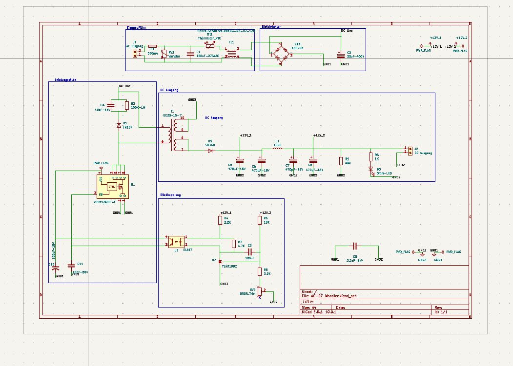
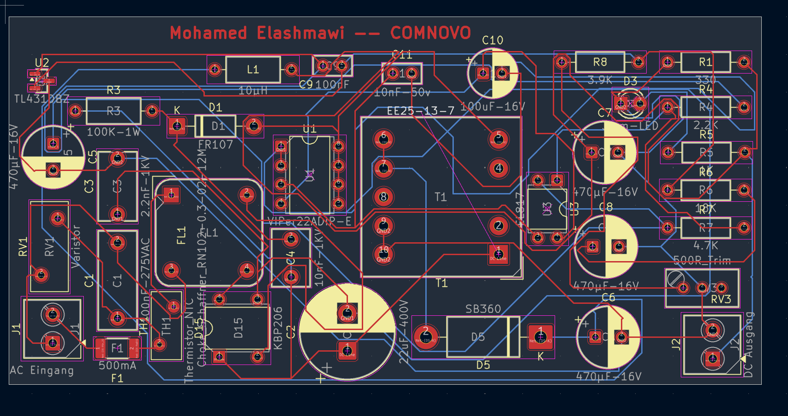
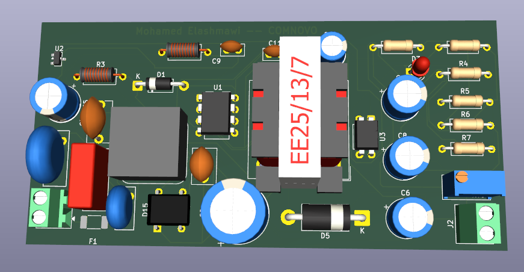

# Flyback AC-DC Converter — 12 V SMPS

**KiCad 10.0.1 | Mohamed Elashmawi | TU Dortmund**

A complete Switch-Mode Power Supply (SMPS) designed from scratch using the flyback
topology, converting 230 VAC mains input to a regulated 12 VDC output. The project
covers full schematic design, PCB layout and 3D validation.

> ⚠️ **Safety notice** — This circuit operates directly on mains voltage (230 VAC).
> Schematic and layout are published for educational and design-reference purposes only.
> Do not build or test it without proper knowledge, equipment and safety precautions.

---

## 📷 Overview

### Schematic


### PCB Layout


### 3D Render


---

## ⚡ Specifications

| Parameter | Value |
|---|---|
| Input voltage | 230 VAC, 50 Hz |
| Output voltage | 12 VDC |
| Topology | Flyback (isolated SMPS) |
| PWM controller | VIPer22A (DIP-8) |
| Transformer | EE25-13-7 |
| Bridge rectifier | KBP206 |
| Output diode | SB360 (Schottky) |
| Feedback / isolation | EL817 optocoupler + TL431 |
| Input protection | Varistor + NTC thermistor + 500 mA fuse |
| EMI filter | Schaffner RN102-0.3-02-12M |

---

## 🔧 Circuit Architecture

The design is split into four functional blocks.

### 1. Input Filter (*Eingangsfilter*)

| Ref | Component | Function |
|---|---|---|
| RV1 | Varistor 275 VAC | Overvoltage / surge protection |
| TH1 | NTC thermistor | Inrush current limiting at start-up |
| FL1 | Schaffner RN102 | Common-mode noise suppression |
| F1 | Fuse 500 mA | Short-circuit protection |
| C1 | X-capacitor 100 nF / 275 VAC | Differential-mode noise filtering |

### 2. Power Stage (*Leistungsstufe*)

| Ref | Component | Function |
|---|---|---|
| D15 | KBP206 | Full-wave rectification |
| C2 | 22 µF / 400 V | DC bus smoothing |
| U1 | VIPer22A | Integrated MOSFET + PWM control |
| T1 | EE25-13-7 | Galvanic isolation & energy transfer |
| R3, C3, D1 | RCD snubber | Drain spike clamping |

### 3. DC Output (*DC Ausgang*)

| Ref | Component | Function |
|---|---|---|
| D5 | SB360 Schottky | Low forward-drop rectification |
| L1 | 10 µH | Output ripple reduction |
| C5–C8 | 470 µF / 16 V | Output voltage smoothing |
| D3 | Status LED | Power-on indication |

### 4. Feedback / Regulation (*Rückkopplung*)

| Ref | Component | Function |
|---|---|---|
| U2 | TL431 | Programmable precision shunt regulator |
| U3 | EL817 optocoupler | Galvanic isolation of the feedback signal |
| RV3 | 500 Ω trimmer | Output voltage fine adjustment |
| R4–R7 | Divider network | Output voltage sensing |

---

## 📐 Key Design Decisions

### RCD snubber

The flyback topology generates high-voltage spikes on the MOSFET drain at turn-off,
caused by the leakage inductance of the transformer. An RCD clamp
(R3 = 100 kΩ, C3 = 2.2 nF / 1 kV, D1 = FR107) absorbs this energy and protects the
MOSFET integrated in the VIPer22A.

### Optocoupler feedback loop

The EL817 combined with the TL431 shunt regulator forms a stable, isolated feedback
loop, keeping the 12 V output regulated across input voltage and load variations
while maintaining the isolation barrier.

### EMI and input filtering

A Schaffner common-mode choke (FL1) together with the X-capacitor (C1) and the NTC
thermistor (TH1) forms the input filter, limiting conducted emissions back into the
mains.

---

## 📦 Bill of Materials (key components)

| Reference | Component | Value / Part number |
|---|---|---|
| U1 | PWM controller | VIPer22ADIP-E |
| U2 | Shunt regulator | TL431DBZ |
| U3 | Optocoupler | EL817 |
| T1 | Transformer | EE25-13-7 |
| D1 | Fast recovery diode | FR107 |
| D5 | Schottky diode | SB360 |
| D15 | Bridge rectifier | KBP206 |
| FL1 | EMI filter | Schaffner RN102-0.3-02-12M |
| RV1 | Varistor | 275 VAC |
| TH1 | NTC thermistor | — |
| C2 | Bulk capacitor | 22 µF / 400 V |
| C5–C8 | Output capacitors | 470 µF / 16 V |
| RV3 | Trimmer | 500 Ω |

---

## 📁 Repository Structure

```
├── AC-DC Wandler.kicad_pro   KiCad project
├── AC-DC Wandler.kicad_sch   Schematic
├── AC-DC Wandler.kicad_pcb   PCB layout
├── fabrication/              Gerber & drill files
└── images/                   Schematic, layout and 3D render
```

---

## 🎓 What I Learned

- Complete SMPS design flow, from topology selection to manufacturing files
- How the VIPer22A integrated PWM controller works and how to design around it
- Sizing an RCD snubber to protect the MOSFET in a flyback converter
- Designing an isolated feedback loop with TL431 and optocoupler
- PCB layout practice for mixed high-voltage / low-voltage boards
- Grounding strategies to reduce EMI in switched-mode supplies
- Using STEP 3D models in KiCad to validate component footprints

---

## 👤 Author

**Mohamed Elashmawi** — B.Sc. Elektrotechnik und Informationstechnik, TU Dortmund
📫 mohamednehmedo716@gmail.com

## 📄 License

MIT — free to use, adapt and learn from. Credits appreciated.
